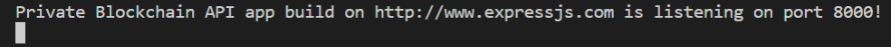
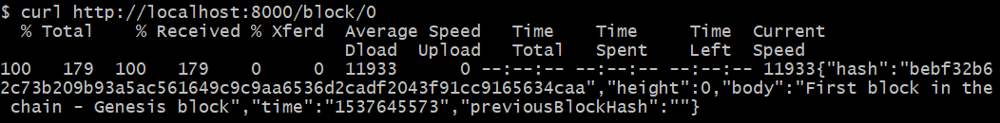
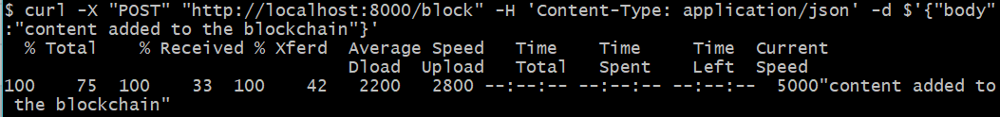
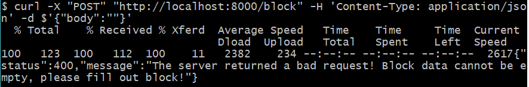

# Project 3 - RESTful Web API with node.js framework
The aim of this project is to build a RESTful API using a node.js framework that will interface with the private blockchain developed under Project 2 where a private blockchain dataset is persist using leveldb.

The API requires two  endpoints:
    * POST block
    * GET block

The API ensures that the web applications are consumable by a veriety of clients. 

## Criteria 1: build the API on a Node.js framework
For this project I used Express.js as the framework. More information and documentation about Express can be found at http://expressjs.com

>Expressjs claims to be Fast, Unopinionated, Minimalist web framework for Node.js

### Requirements or dependencies I used for this project are:
    * Node.js: v8.12.0
    * npm
    * express
    * leveldb
    * crypto-js
    * body-parser

## Criteria 2 - The API must run on port 8000

1. Download the repo
2. run npm

    ` npm install`

3. start API server

    `node index.js`

```javascript
    const express = require('express')
    const app = express()
    const port = 8000
```
    The API server is listening on port 8000 at localhost. http://localhost:8000



## Criteria 3 - GET Block Endpoint
The GET Endpoint responds to a request using a URL with a block height parameter. An error is handled if the height parameter is out of bounds.

The response for the endpoint provides a block object in JSON format. 

`http://localhost:8000/block/0`

```json
    {
    "hash":"49cce61ec3e6ae664514d5fa5722d86069cf981318fc303750ce66032d0acff3",
    "height":0,
    "body":"First block in the chain - Genesis block",
    "time":"1530311457",
    "previousBlockHash":""
    }
```

CURL is used to test the GET endpoint in this project:

`curl http://localhost:8000/block/0`




## Criteria 4 - POST Block Endpoint
The POST endpoint allows posting a new block with data. The block body text supports a string of text.

The repsonse for the endpoint is a block object in JSON format.

`http://localhost:8000/block`

```json
    {
        "body": "Testing block with test string data"
    }
```

CURL is used to test the POST endpoint in this project

`curl -X "POST" "http://localhost:8000/block" -H 'Content-Type: application/json' -d $'{"body":"content added to the blockchain"}'`



    
## Criteria 5 - Handle error when there is an attempt to post without content

```javascript
    if (req.body.body === undefined || req.body.body === '') {
            res.status(400).json({
                "status": 400,
                "message": 'The server returned a bad request! Block data cannot be empty, please fill out block!'})

        }
```
`curl -X "POST" "http://localhost:8000/block" -H 'Content-Type: application/json' -d $'{"body":""}'`




